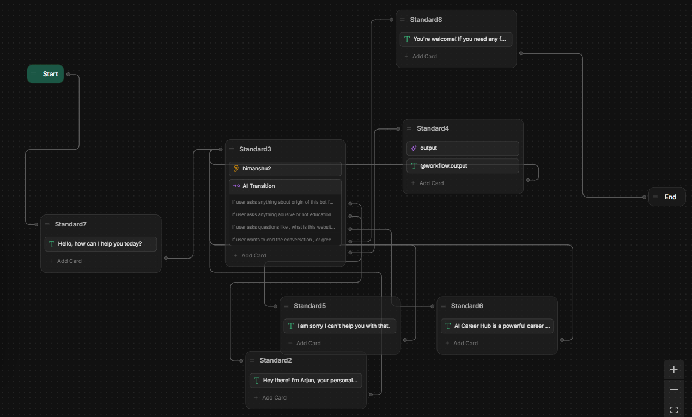

# ARJUN

Welcome to the documentation of **ARJUN**, a conversational bot designed to handle user queries efficiently and provide meaningful responses. Built using **Botpress**, a robust platform for creating conversational agents, ARJUN is structured to manage interactions seamlessly. Below, we’ll dive into how the bot works, its architecture, and its functionality.

---

## Overview

ARJUN is designed to handle a variety of user interactions through intelligently designed standard nodes that manage user queries contextually. With upgraded features like conversational memory and interactive AI transitions, ARJUN provides a dynamic and responsive experience to users.

---

## How It Works

ARJUN operates through six standard nodes, each responsible for handling specific user intents. Here's a detailed breakdown of their roles:

1. **Standard7**:  
   This is the starting node that initiates the conversation by greeting the user with *"Hello, how can I help you?"* It listens to the user's input, stores it in a variable, and routes it to the appropriate standard node using AI transitions.

2. **Standard2**:  
   This node is activated when the user inquires about the bot's origin, purpose, or development background. It provides context about why ARJUN was created and its role.

3. **Standard5**:  
   Handles uneducational or inappropriate queries. It keeps the conversation respectful by guiding users back to relevant or acceptable topics.

4. **Standard6**:  
   This standard is used when a user asks for information related to the platform or website. It provides accurate and informative responses regarding the project or system the bot is a part of.

5. **Standard8**:  
   If the user wants to end the conversation, this node is triggered. It offers a wholesome and polite farewell message, ensuring a satisfying user experience.

6. **Standard4**:  
   Acts as the general-purpose handler. It processes any query not matched by the other standards using the GPT-4.0 mini language model. This node supports technical queries, can generate code, and keeps the conversation going based on user engagement.

---

## Key Features

- **Conversational Memory**: ARJUN now remembers user interactions within the session, creating a more coherent and context-aware chat experience.
- **Adaptive Response Length**: Typically responds in under 50 words for general queries, but expands to detailed responses for technical/code-related questions.
- **Continuous Interaction**: The bot remains in a conversational loop until the user decides to end the chat, enhancing interactivity.

---

## Structure

The architecture of ARJUN is visualized in the image below. The flow between different standard nodes is designed to ensure a seamless and intuitive user experience.

- **Start**: Conversation begins with Standard7.
- **Standard2, Standard5, Standard6, Standard8, Standard4**: Routes based on AI transition logic from the user's input.
- **End**: Handled by Standard8 to gracefully close the session.

---

## Image Reference

Refer to the image above for a better understanding of ARJUN’s flow and how user queries transition between states.

---

## Conclusion

ARJUN is a dynamic conversational agent built on Botpress, now enhanced with memory and context-awareness. It handles a wide range of user queries by intelligently transitioning through six robust standard nodes, ensuring a more interactive and satisfying experience.

---

## Prototype Stage and Future Improvements

ARJUN is currently in the **prototype stage**, with exciting improvements planned:

- **Smarter NLP**: Enhancing understanding of complex and abstract queries.
- **Larger Knowledge Base**: Covering more topics for educational and platform-specific queries.
- **User-Driven Refinement**: Leveraging feedback to tailor interactions further.
- **Robust Error Handling**: Ensuring graceful handling of unexpected inputs.

---

## Try ARJUN Now!

Experience the seamless interaction by trying our bot via the link below. We’d love to hear your feedback!

[**Link for the Webchat**](https://cdn.botpress.cloud/webchat/v2.2/shareable.html?configUrl=https://files.bpcontent.cloud/2025/01/27/19/20250127193107-ZDZNBDZ1.json)

---

Feel free to explore ARJUN and its capabilities further! If you have any suggestions, your input is most welcome.

